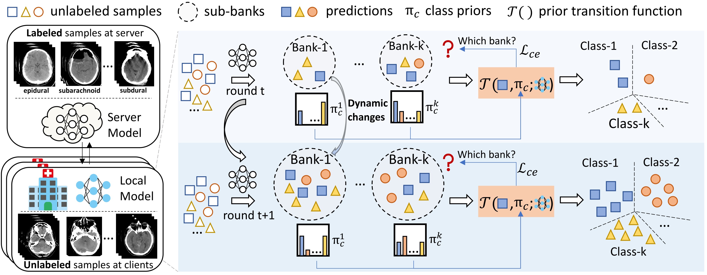

# Dynamic Bank Learning for Semi-supervised Federated Image Diagnosis with Class Imbalance (imFedSemi)

Pytorch implementation for MICCAI 2022 paper **[Dynamic Bank Learning for Semi-supervised Federated Image Diagnosis with Class Imbalance](https://github.com/med-air/imFedSemi)** by [Meirui Jiang](https://github.com/MeiruiJiang), [Hongzheng Yang](https://github.com/HongZhengYang), [Xiaoxiao Li](https://xxlya.github.io/xiaoxiao/), [Quande Liu](https://liuquande.github.io/), [Pheng-Ann Heng](http://www.cse.cuhk.edu.hk/~pheng/) and [Qi Dou](http://www.cse.cuhk.edu.hk/~qdou/).

<p align="center">

</p>

## Abstract
> Despite recent progress on semi-supervised federated learning (FL) for medical image diagnosis, the problem of imbalanced class distributions among unlabeled clients is still unsolved for real-world use. In this paper, we study a practical yet challenging problem of class imbalanced semi-supervised FL (imFed-Semi), which allows all clients to have only unlabeled data while the server just has a small amount of labeled data. This imFed-Semi problem is addressed by a novel dynamic bank learning scheme, which improves client training by exploiting class proportion information. This scheme consists of two parts, the dynamic bank construction to distill various class proportions for each local client, and the sub-bank classification to impose the local model to learn different class proportions. We evaluate our approach on two public real-world medical datasets, including the intracranial hemorrhage diagnosis with 25,000 CT slices and skin lesion diagnosis with 10,015 dermoscopy images. The effectiveness of our method has been shown with significant performance improvements (7.61\% and 4.69\%) compared with the second-best on the accuracy, as well as comprehensive analytical studies.
## Setup
**Conda**

We recommend using conda to setup the environment, See the `requirements.txt` for environment configuration 

If there is no conda installed on your PC, please find the installers from [here.](https://www.anaconda.com/products/individual)

If you have already installed conda, please use the following commands.

```bash
conda install --file requirements.txt
```
**Pip**
```bash
pip install -r requirements.txt
```

## Dataset 
Please download the dataset from [kaggle](https://www.kaggle.com/c/rsna-intracranial-hemorrhage-detection) and preprocess it follow this [notebook](https://www.kaggle.com/guiferviz/prepare-dataset-resizing-and-saving-as-png). Or download the preprocessed data from [here.](https://drive.google.com/drive/folders/1AFkJn3B4ubhdNiuw3stUneVRitA8idEq?usp=sharing)


## Run
### Training
`train_main.py` is the main file to run the federated experiments
Please using following commands to train the model with our proposed method. Before training, please make sure the ‘root_path’ option in `option.py` to your downloaded data path accordingly.
```bash
python train_main.py 
```
### Testing
We have provided our trained model for testing with the following script. You can test your own trained model by updat the 'model_path' option in `option.py`.
```bash
python test.py 
```
## Citation
If this repository is useful for your research, please cite:

       @article{jiang2022imfedsemi,
         title={Dynamic Bank Learning for Semi-supervised Federated Image Diagnosis with Class Imbalance},
         author={Jiang, Meirui and Yang, Hongzheng and Li, Xiaoxiao and Liu, Quande and Heng, Pheng-Ann and Dou, Qi},
         journal={International Conference on Medical Image Computing and Computer Assisted Intervention},
         year={2022}
       }  

### Questions
Please contact 'mrjiang@cse.cuhk.edu.hk' or 'hzyang05@gmail.com'
